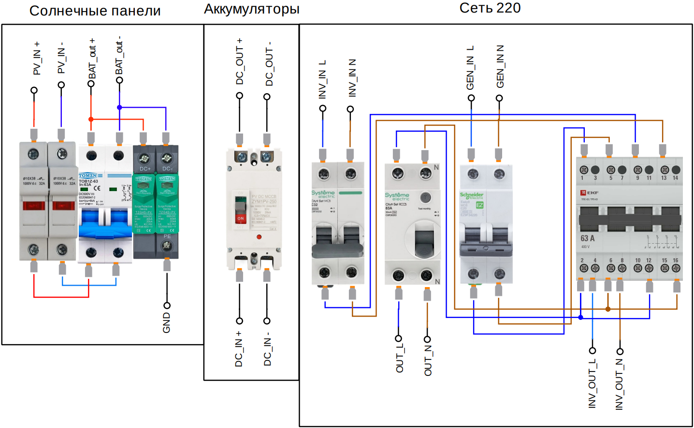

# Опыт сборки домашней солнечной электростанции

Репозиторий создан для фиксации личного опыта проектирования и сборки резервной солнечной электростанции. Здесь собраны спецификации оборудования, схемы защиты, особенности монтажа и фотографии готовой системы.

---

## 📋 Основные характеристики системы

* **Инвертор:** SILA VP 6200MH PLUS (1 шт.)
* **Солнечные батареи:** SunPro 480 Вт TOPCon (10 шт., общая мощность 4.8 кВт)
  * *Конфигурация:* последовательное соединение **10s1p**
* **Аккумуляторы:** LiFePO4 SILAsolution LFP48-100 (2 шт., общая ёмкость 9.6 кВт·ч)
  * *Конфигурация:* параллельное соединение **1s2p**
* **Максимальное пиковое потребление:** до 4 кВт.
* **Резервный источник питания:** бензогенератор на 2 кВт (на экстренный случай).

---

## 🛠 Используемые комплектующие и ссылки

### Силовое оборудование

| Наименование | Описание | Ссылка на магазин |
| :--- | :--- | :--- |
| **Инвертор** | SILA VP 6200MH PLUS | [Greenlike](https://greenlike.biz/catalog/invertory/gi/sila-vp-6200mh-plus/) |
| **Солнечные панели** | SunPro 480W TOPCon (10 шт.) | [Greenlike](https://greenlike.biz/catalog/sp/mono/sunpro-480w/) |
| **Аккумуляторы** | LiFePO4 SILAsolution LFP48-100 (48В, 4.8 кВт·ч) | [Ozon](https://www.ozon.ru/product/lifepo4-akkkumulyator-48v-silasolution-lfp48-100-4-80-kvt-ch-litiy-zhelezo-fosfatnyy-akkumulyator-1717770285/) |

### Системы защиты и коммутации

| Назначение | Модель / Описание | Ссылка на магазин |
| :--- | :--- | :--- |
| **Защита аккумуляторов** | Автоматический выключатель в литом корпусе (MCCB) 200A 2P DC 1000V | [Ozon](https://www.ozon.ru/product/avtomaticheskiy-vyklyuchatel-v-litom-korpuse-200a-mccb-vyklyuchatel-zashchity-solnechnoy-batarei-2p-1807735172/) |
| **Грозозащита (УЗИП)** | Двухполюсный УЗИП CHLT-40PV (600V DC, 20-40kA) | [Ozon](https://www.ozon.ru/product/dvuhpolyusnyy-uzip-chlt-40pv-600v-dc-20-40ka-dlya-zashchity-nizkovoltnyh-solnechnyh-sistem-3582301081/) |
| **Рубильник солнечных батарей** | Двухполюсный мини-автомат (MCB) 2P DC 1000V 63A | [Ozon](https://www.ozon.ru/product/2p-dc-1000v-solnechnyy-mini-avtomaticheskiy-vyklyuchatel-mcb-dlya-fotoelektricheskoy-sistemy-63a-2839105880/) |
| **Предохранители панелей** | Двухполюсный держатель с плавкими вставками 1000VDC 20A (GYPV-1038) | [Ozon](https://www.ozon.ru/product/predohranitel-serii-2p-dlya-solnechnyh-fotoelektricheskih-paneley-2773767839/) |

---

## 🔌 Особенности коммутации и монтажа

### 1. Подключение аккумуляторов к инвертору
* Использован кабель **КГ-ТП-ХЛ** сечением **25 мм²** (по два кабеля параллельно на каждый полюс). В итоге получено суммарное сечение **50 мм²** на полюс для минимизации потерь и нагрева.
* В цепь между аккумулятором и инвертором установлен силовой автомат в литом корпусе **MCCB на 200А**.

### 2. Подключение солнечных панелей
* В целях оптимизации бюджета вместо стандартного солнечного кабеля применён кабель **КГ-ТП-ХЛ 2х2.5 мм²**. Жилы объединены параллельно, что дало сечение **5 мм²** на полюс.
* Вся проводка по улице и помещению уложена в гофрированную трубу **ПП-HF диаметром 20 мм**.
* Соединения кабеля КГ с штатными кабелем панелей выполнены с использованием **ГМЛ 4 мм²** под опрессовку и изолированы клеевой термоусадкой для полной герметичности.

### 3. Узел защиты фотоэлектрического (PV) контура
На входе в инвертор со стороны солнечных панелей собрана схема защиты:
* **УЗИП CHLT-40PV** для защиты от импульсных перенапряжений.
* **Двухполюсный автомат MCB на 63А** (используется в качестве рубильника для безопасного отключения линии).
* **Плавкие предохранители на 20А** в качестве дополнительной защиты от сверхтоков.

---

## 📸 Фотографии проекта
### На рисунке ниже представлена схема щита 
Для перевода нагрузки на питание от генератора с одновременным обеспечением заряда аккумуляторных батарей используется четырёхполюсный трёхпозиционный переключатель. Это решение позволяет минимизировать количество ручных манипуляций с групповыми автоматическими выключателями и исключить ошибки при коммутации. Данная схема подключения обусловлена спецификой условий эксплуатации системы.

 

---

# ⚠️Дисклеймер
Вся информация и схемы представлены исключительно в ознакомительных целях как описание личного опыта. Работы с постоянным током высокого напряжения и литиевыми аккумуляторами требуют строгого соблюдения техники безопасности. При повторении подобных схем вы действуете на свой собственный страх и риск.
